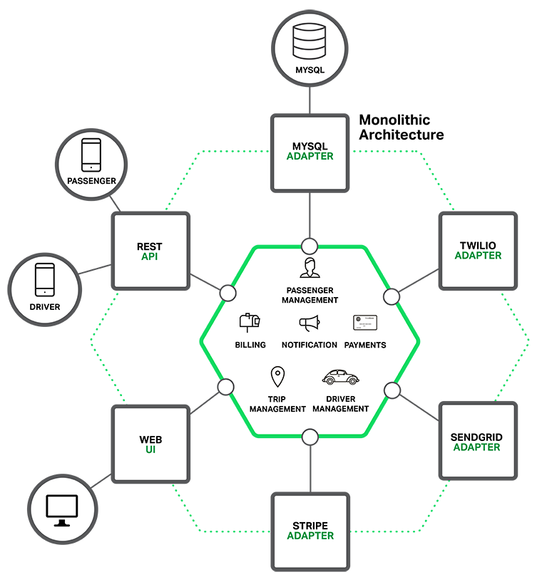
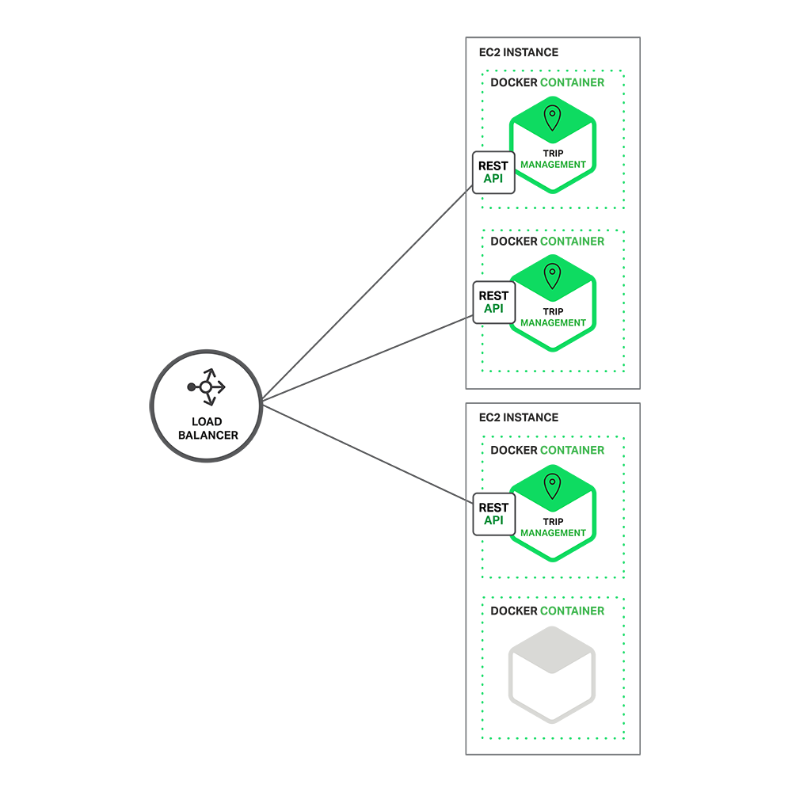
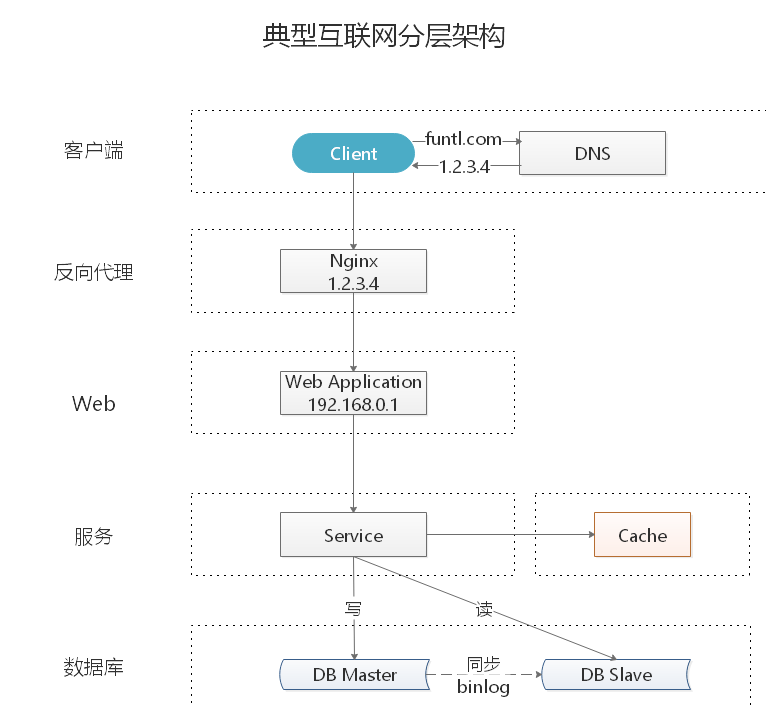
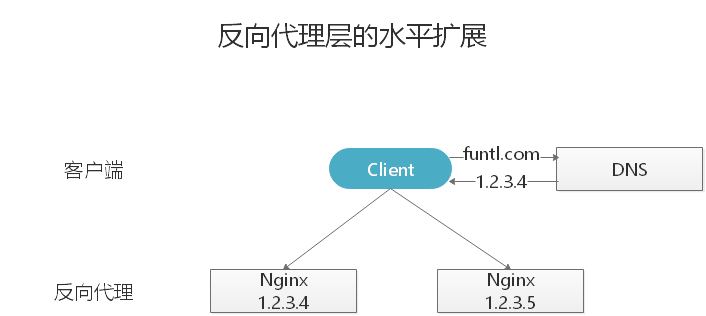
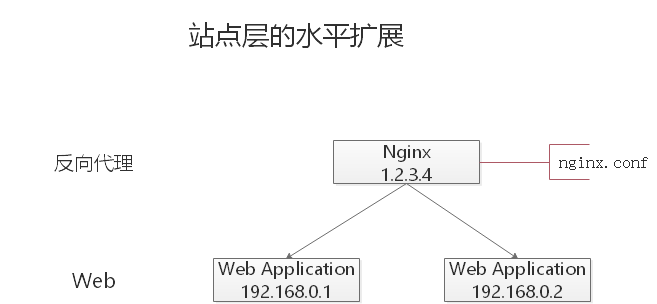
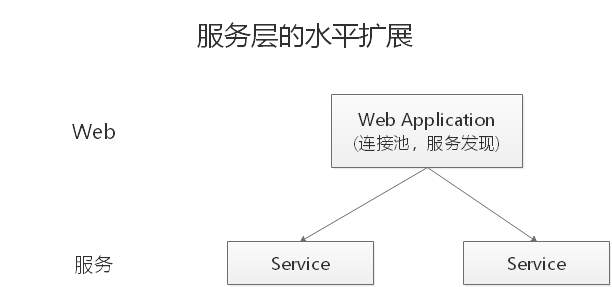
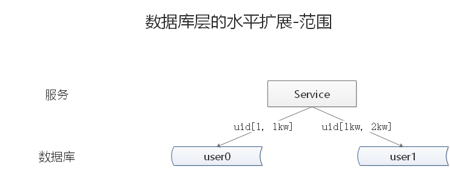
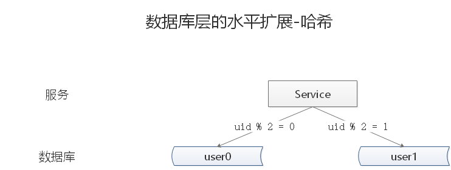

[TOC]

# 01 构建单体应用模型

## 概述

我们假设，您开始开发一个打车应用，打算与 `Uber` 和 `Hailo` 竞争。经过初步交流和需求收集，您开始手动或者使用类似 `Rails`、`Spring Boot`、`Play` 或者 `Maven` 等平台来生成一个新项目。该新应用是一个模块化的六边形架构，如下图（一个简单的打车应用）所示：

该应用的核心是由模块实现的业务逻辑，它定义了服务、领域对象和事件。围绕核心的是与外部世界接口对接的适配器。适配器示例包括数据库访问组件、生产和消费消息的消息组件和暴露了 API 或实现了一个 UI 的 web 组件。

尽管有一个逻辑模块化架构，但应用程序被作为一个单体进行打包和部署。实际格式取决于应用程序的语言和框架。例如，许多 Java 应用程序被打包成 WAR 文件部署在如 Tomcat 或者 Jetty 之类的应用服务器上。其他 Java 应用程序被打包成自包含 (self-contained) 的可执行 JAR。类似地， Rails 和 Node.js 应用程序被打包为有目录层次的结构

以这种风格编写的应用是很常见的。他们很容易开发，因为我们的 IDE 和其他工具就是专注于构建单体应用。这些应用程序也很容易测试， 您可以通过简单地启动并使用如 Selenium 测试包来测试 UI 以轻松地实现端到端 (end-to-end) 测试。单体应用同样易于部署。您只需拷贝打包好的应用程序到服务器上。您还可以通过运行多个副本和结合负载均衡器来扩展应用。在项目的早期阶段，它可以良好运作。

# 02 走向单体地狱

## 概述

不幸的是，这种简单的方法有很大的局限性。成功的应用有一个趋势，随着时间推移而变得越来越臃肿。您的开发团队在每个冲刺阶段都要实现更多的用户需求，这意味着需要添加了许多行代码。几年之后，小而简单的应用将会逐渐成长成一个庞大的单体。为了给出一个极端示例，我最近和一位开发者做了交谈，他正在编写一个工具，该工具用于从他们的数百万行代码 (lines of code， LOC) 应用中分析出数千个 JAR 之间的依赖。我相信这是大量开发者在多年齐心协力下创造出了这样的野兽。

一旦您的应用程序成为了一个庞大、复杂的单体，您的开发组织可能会陷入了一个痛苦的境地，敏捷开发和交付的任何一次尝试都将原地徘徊。一个主要问题是应用程序实在非常复杂。对于任何一个开发人员来说显得过于庞大，这是可以理解的。最终，正确修复 bug 和实现新功能变得非常困难而耗时。此外， 这种趋势就像是往下的螺旋。如果基本代码都令人难以理解，那么改变也不会变得正确，您最终得到的将是一个巨大且不可思议的大泥球。

应用程序的规模也将减缓发展。应用程序越大，启动时间越长。我调查过开发者们的单体应用的大小和性能，一些报告的启动时间为 12 分钟。我也听说过应用程序启动需要 40 分钟以上的怪事。如果开发人员经常要重启应用服务器，那么很大一部分时间都是在等待中度过，他们的生产力将受到限制。

另一个大问题是，复杂的单体应用本身就是持续部署的障碍。如今， SaaS 应用发展到了可以每天多次将变更推送到生产环境中。这对于复杂的单体来说非常困难，因为您需要重新部署整个应用程序才能更新其中任何一部分。 联想到我之前提到的漫长启动时间，这也不会是什么好事。此外，因变更所产生的影响通常不是很明确，您很可能需要做大量的手工测试。因此，持续部署是不可能做到的。

当不同模块存在资源需求冲突时，单体应用可能难以扩展。例如，一个模块可能会执行 CPU 密集型图像处理逻辑，理想情况下是部署在 Amazon EC2 Compute Optimized 实例中。另一个模块可能是一个内存数据库，最适合部署到 EC2 Memory-optimized 实例。然而， 由于这些模块被部署在一起，您必须在硬件选择上做出妥协。

单体应用的另一个问题是可靠性。因为所有模块都运行在同一进程中。任何模块的一个 bug，比如内存泄漏，可能会拖垮整个进程。此外，由于应用程序的所有实例都是相同的，该错误将影响到整个应用的可用性。

最后但同样重要，单体应用使得采用新框架和语言变得非常困难。例如，我们假设您有 200 万行代码使用了 XYZ 框架编写。如果使用较新的 ABC 框架来重写整个应用，这将非常昂贵（在时间和成本方面），即使框架非常好。因此，这对于采用新技术是一个非常大的障碍。在项目开始时， 您无论选择何种新技术都会感到困扰。

总结一下：您有一个成功的关键业务应用程序，它已经发展成为一个只有少数开发人员（如果有的话）能够理解的巨大单体。它使用了过时、非生产性技术编写，这使得招聘优秀开发人员变得非常困难。应用程序变得难以扩展，不可靠。因此敏捷开发和应用交付是不可能的。

# 03 微服务解决复杂问题

## 概述

许多如 Amazon、 eBay 和 Netflix 这样的组织，已经采用现在所谓的微服务架构模式解决了这个问题，而不是构建一个臃肿的单体应用。它的思路是将应用程序分解成一套较小的互连服务。一个服务通常实现了一组不同的特性或功能，例如订单管理、客户管理等。每一个微服务都是一个迷你应用，它自己的六边形架构包括了业务逻辑以及多个适配器。

一些微服务会暴露一个供其他微服务或应用客户端消费的 API。其他微服务可能实现了一个 web UI。在运行时，每个实例通常是一个云虚拟机 (virtual machine， VM) 或者一个 Docker 容器。

例如，前面描述的系统可能分解成如下图（一个单体应用分解成微服务) 所示：

应用程序的每个功能区域现在都由自己的微服务实现。此外，Web 应用程序被划分为一组更简单的 Web 应用程序。例如，以我们的出租车为例，一个是乘客的应用，一个是司机的应用。这使得它更容易地为特定的用户、司机、设备或者专门的用例部署不同的场景。每个后端服务暴露一个 REST API，大部分服务消费的 API 由其他服务提供。例如， Driver Management 使用了 Notification 服务器来通知一个可用司机一个可选路程。UI 服务调用了其他服务来渲染页面。服务也可以使用异步、基于消息的通信。

一些 REST API 也暴露给移动端应用以供司机和乘客使用。然而，应用不能直接访问后端服务。相反，他们之间的通信是由一个称为 API 网关 (API Gateway) 的中介负责。 API 网关负责负载均衡、缓存、访问控制、 API 计量和监控， 可以通过使用 NGINX 来实现。

开发和交付中的伸缩立方：

微服务架构模式相当于此伸缩立方的 Y 轴坐标，此立方是一个来自《架构即未来》 的三维伸缩模型。另外两个坐标轴是由运行多个相同应用程序副本的负载均衡器组成的X 轴坐标和 Z 轴坐标（或数据分区) ，其中请求的属性（例如，一行记录的主键或者客户标识) 用于将请求路由到特定的服务器。

在运行时，X 坐标轴上运行着服务的多个实例，每个服务配合负载均衡器以满足吞吐量和可用性。某些应用程序也有可能使用 Z 坐标轴来进行分区服务。下图展示了如何用 Docker 将 Trip Management 服务部署到 Amazon EC2 上运行。

使用 Docker 部署 Trip Management 服务：

在运行时，Trip Management 服务由多个服务实例组成，每个服务实例是一个 Docker容器。为了实现高可用，容器是在多个云虚拟机上运行的。服务实例的之前是一个类似 NGINX 的负载均衡器，用于跨实例分发请求。负载均衡器也可以处理其他问题，如缓存、访问控制、API 度量和监控。

微服务架构模式明显影响到了应用程序与数据库之间的关系。与其他共享单个数据库模式 (schema) 服务有所不同， 其每一个服务都有自己的数据库模式。一方面，这种做法与企业级数据库数据模型的想法相背，此外，它经常导致部分数据冗余。然而，如果您想从微服务中受益，每一个服务都应该有自己的数据库模式。因为它能实现松耦合。下图展示了数据库架构示例应用程序。

每个服务都拥有各自的数据库。而且，服务可以使用一种最适合其需求、号称多语言持久架构 （polyglot persistence architecture ) 的数据库。例如，DriverManagement，要找到与潜在乘客接近的司机，就必须使用支持高效地理查询的数据库。

打车应用的数据库架构：

从表面上看，微服务架构模式类似于 SOA。微服务是由一组服务组成。然而，换另一种方式去思考微服务架构模式，它是没有商业化的 SOA，没有集成 Web 服务规范 (WS-*) 和企业服务总线 (Enterprise Service Bus， ESB) 。基于微服务的应用支持更简单、轻量级的协议，例如，REST，而不是 WS-*。他们也尽量避免使用 ESB，而是实现微服务本身具有类似 ESB 的功能。微服务架构也拒绝了 SOA 的其他部分，例如，数据访问规范模式概念。

# 04 微服务的优点

## 概述

微服务架构模式有许多非常好的地方。

第一，它解决了复杂问题。它把可能会变得庞大的单体应用程序分解成一套服务。虽然功能数量不变，但是应用程序已经被分解成可管理的块或者服务。每个服务都有一个明确定义边界的方式，如远程过程调用（RPC）驱动或消息驱动 API。微服务架构模式强制一定程度的模块化，实际上，使用单体代码来实现是极其困难的。因此，使用微服务架构模式，个体服务能被更快地开发，并更容易理解与维护。

第二，这种架构使得每个服务都可以由一个团队独立专注开发。开发者可以自由选择任何符合服务 API 契约的技术。当然，更多的组织是希望通过技术选型限制来避免完全混乱的状态。然而，这种自由意味着开发人员不再有可能在这种自由的新项目开始时使用过时的技术。当编写一个新服务时，他们可以选择当前的技术。此外，由于服务较小，使用当前技术重写旧服务将变得更加可行。

第三，微服务架构模式可以实现每个微服务独立部署。开发人员根本不需要去协调部署本地变更到服务。这些变更一经测试即可立即部署。比如，UI 团队可以执行 A|B 测试，并快速迭代 UI 变更。微服务架构模式使得持续部署成为可能。

最后，微服务架构模式使得每个服务能够独立扩展。您可以仅部署满足每个服务的容量和可用性约束的实例数目。此外，您可以使用与服务资源要求最匹配的硬件。例如，您可以在 EC2 Compute Optimized 实例上部署一个 CPU 密集型图像处理服务，并且在 EC2 Memory-optimized 实例上部署一个内存数据库服务。

# 05 微服务的缺点

## 概述

就像 Fred Brooks 大约在 30 年前写的《人月神话》中说的，没有银弹。与其他技术一样，微服务架构模式也存在着缺点。其中一个缺点就是名称本身。微服务这个术语的重点过多偏向于服务的规模。事实上，有些开发者主张构建极细粒度的 10 至 100 LOC（代码行） 服务，虽然这对于小型服务可能比较好，但重要的是要记住，小型服务只是一种手段，而不是主要目标。微服务的目标在于充分分解应用程序以方便应用敏捷开发和部署。

微服务另一个主要缺点是由于微服务是一个分布式系统，其使得整体变得复杂。开发者需要选择和实现基于消息或者 RPC 的进程间通信机制。此外，由于目标请求可能很慢或者不可用，他们必须要编写代码来处理局部故障。虽然这些并不是很复杂、高深，但模块间通过语言级方法/过程调用相互调用，这比单体应用要复杂得多。

微服务的另一个挑战是分区数据库架构。更新多个业务实体的业务事务是相当普遍的。这些事务在单体应用中的实现显得微不足道，因为单体只存在一个单独的数据库。在基于微服务的应用程序中，您需要更新不同服务所用的数据库。通常不会选择分布式事务，不仅仅是因为 **CAP 定理**。他们根本不支持如今高度可扩展的 NoSQL 数据库和消息代理。您最后不得不使用基于最终一致性的方法，这对于开发人员来说更具挑战性。

测试微服务应用程序也很复杂。例如，使用现代框架如 Spring Boot，只需要编写一个测试类来启动一个单体 web 应用程序并测试其 REST API。相比之下，一个类似的测试类对于微服务来说需要启动该服务及其所依赖的所有服务，或者至少为这些服务配置存根。再次声明，虽然这不是一件高深的事情，但不要低估了这样做的复杂性。

微服务架构模式的另一个主要挑战是实现了跨越多服务变更。例如，我们假设您正在实现一个变更服务 A、服务 B 和 服务 C 的需求，其中 A 依赖于 B，且 B 依赖于 C。在单体应用程序中，您可以简单地修改相应的模块、整合变更并一次性部署他们。相反，在微服务中您需要仔细规划和协调出现的变更至每个服务。例如，您需要更新服务 C，然后更新服务 B，最后更新服务 A。幸运的是，大多数变更只会影响一个服务，需要协调的多服务变更相对较少。

部署基于微服务的应用程序也是相当复杂的。一个单体应用可以很容易地部署到基于传统负载均衡器的一组相同服务器上。每个应用程序实例都配置有基础设施服务的位置（主机和端口），比如数据库和消息代理。相比之下，微服务应用程序通常由大量的服务组成。例如，据 Adrian Cockcroft 了解到，Hailo 拥有 160 个不同的服务，Netflix 拥有的服务超过 600 个。

每个服务都有多个运行时实例。还有更多的移动部件需要配置、部署、扩展和监控。此外，您还需要实现服务发现机制，使得服务能够发现需要与之通信的任何其他服务的位置（主机和端口）。比较传统麻烦的基于票据（ticket-based）和手动的操作方式无法扩展到如此复杂程度。因此，要成功部署微服务应用程序，需要求开发人员能高度控制部署方式和高度自动化。

一种自动化方式是使用现成的平台即服务（PaaS），如 Cloud Foundry。PaaS 为开发人员提供了一种简单的方式来部署和管理他们的微服务。它让开发人员避开了诸如采购和配置 IT 资源等烦恼。同时，配置 PaaS 的系统人员和网络专业人员可以确保达到最佳实践以落实公司策略。

自动化微服务部署的另一个方式是开发自己的 PaaS。一个普遍的起点是使用集群方案，如 Kubernetes，与 Docker 等容器技术相结合。

## 小结

构建复杂的微服务应用程序本质上是困难的。单体架构模式只适用于简单、轻量级的应用程序，如果您使用它来构建复杂应用，您最终会陷入痛苦的境地。微服务架构模式是复杂、持续发展应用的一个更好的选择。尽管它存在着缺点和实现挑战。

# 06 CAP定理与BASE理论

## CAP 定理

2000 年 7 月，加州大学伯克利分校的 Eric Brewer 教授在 ACM PODC 会议上提出 CAP 猜想。2年后，麻省理工学院的 Seth Gilbert 和 Nancy Lynch 从理论上证明了 CAP。之后，CAP 理论正式成为分布式计算领域的公认定理。

CAP 理论为：一个分布式系统最多只能同时满足一致性（Consistency）、可用性（Availability）和分区容错性（Partition tolerance）这三项中的两项。

- **一致性(Consistency)：** 一致性指 (all nodes see the same data at the same time)，即更新操作成功并返回客户端完成后，所有节点在同一时间的数据完全一致。
- **可用性(Availability)：** 可用性指(Reads and writes always succeed)，即服务一直可用，而且是正常响应时间。
- **分区容错性(Partition tolerance)：** 分区容错性指(the system continues to operate despite arbitrary message loss or failure of part of the system)，即分布式系统在遇到某节点或网络分区故障的时候，仍然能够对外提供满足一致性和可用性的服务。

## CAP 权衡

通过 CAP 理论，我们知道无法同时满足一致性、可用性和分区容错性这三个特性，那要舍弃哪个呢？

对于多数大型互联网应用的场景，主机众多、部署分散，而且现在的集群规模越来越大，所以节点故障、网络故障是常态，而且要保证服务可用性达到 N 个 9，即保证 P 和 A，舍弃C（退而求其次保证最终一致性）。虽然某些地方会影响客户体验，但没达到造成用户流程的严重程度。

对于涉及到钱财这样不能有一丝让步的场景，C 必须保证。网络发生故障宁可停止服务，这是保证 CA，舍弃 P。貌似这几年国内银行业发生了不下 10 起事故，但影响面不大，报道也不多，广大群众知道的少。还有一种是保证 CP，舍弃 A。例如网络故障是只读不写。

孰优孰略，没有定论，只能根据场景定夺，适合的才是最好的。

## BASE 理论

eBay 的架构师 Dan Pritchett 源于对大规模分布式系统的实践总结，在 ACM 上发表文章提出 BASE 理论，BASE 理论是对 CAP 理论的延伸，核心思想是即使无法做到强一致性（Strong Consistency，**CAP 的一致性就是强一致性**），但应用可以采用适合的方式达到最终一致性（Eventual Consitency）。

- **基本可用(Basically Available)：** 基本可用是指分布式系统在出现故障的时候，允许损失部分可用性，即保证核心可用。电商大促时，为了应对访问量激增，部分用户可能会被引导到降级页面，服务层也可能只提供降级服务。这就是损失部分可用性的体现。
- **软状态(Soft State)：** 软状态是指允许系统存在中间状态，而该中间状态不会影响系统整体可用性。分布式存储中一般一份数据至少会有三个副本，允许不同节点间副本同步的延时就是软状态的体现。MySQL Replication 的异步复制也是一种体现。
- **最终一致性(Eventual Consistency)：** 最终一致性是指系统中的所有数据副本经过一定时间后，最终能够达到一致的状态。弱一致性和强一致性相反，最终一致性是弱一致性的一种特殊情况。

## ACID 和 BASE 的区别与联系

ACID 是传统数据库常用的设计理念，追求强一致性模型。BASE 支持的是大型分布式系统，提出通过牺牲强一致性获得高可用性。

ACID 和 BASE 代表了两种截然相反的设计哲学，在分布式系统设计的场景中，系统组件对一致性要求是不同的，因此 ACID 和 BASE 又会结合使用。

# 07 如何应对高并发

## 什么是高并发

高并发(High Concurrency)是互联网分布式系统架构设计中必须考虑的因素之一，它通常是指，通过设计保证系统能够同时并行处理很多请求。高并发相关常用的一些指标有 **响应时间(Response Time)**，**吞吐量(Throughput)**，**每秒查询率 QPS(Query Per Second)**，**并发用户数** 等。

- **响应时间：** 系统对请求做出响应的时间。例如系统处理一个 HTTP 请求需要 200ms，这个 200ms 就是系统的响应时间。
- **吞吐量：** 单位时间(年，月，日，时，分，秒)内处理的请求数量。
- **QPS：** 每秒响应请求数。在互联网领域，这个指标和吞吐量区分的没有这么明显。
- **并发用户数：** 同时承载正常使用系统功能的用户数量。例如一个即时通讯系统，同时在线量一定程度上代表了系统的并发用户数。

## 如何提升系统的并发能力

互联网分布式架构设计，提高系统并发能力的方式，方法论上主要有两种：**垂直扩展(Scale Up)** 与 **水平扩展(Scale Out)**。

### 垂直扩展

提升单机处理能力。垂直扩展的方式又有两种：

- 增强单机硬件性能，例如：增加 CPU 核数如 32 核，升级更好的网卡如万兆，升级更好的硬盘如 SSD，扩充硬盘容量如 2T，扩充系统内存如 128G；
- 提升单机架构性能，例如：使用 Cache 来减少 IO 次数，使用异步来增加单服务吞吐量，使用无锁数据结构来减少响应时间；

在互联网业务发展非常迅猛的早期，如果预算不是问题，强烈建议使用 “增强单机硬件性能” 的方式提升系统并发能力，因为这个阶段，公司的战略往往是发展业务抢时间，而 “增强单机硬件性能” 往往是最快的方法。

不管是提升单机硬件性能，还是提升单机架构性能，都有一个致命的不足：单机性能总是有极限的。所以互联网分布式架构设计高并发终极解决方案还是水平扩展。

### 水平扩展

只要增加服务器数量，就能线性扩充系统性能。水平扩展对系统架构设计是有要求的，如何在架构各层进行可水平扩展的设计，以及互联网公司架构各层常见的水平扩展实践，是本文重点讨论的内容。

## 典型互联网分层架构

- **客户端层：** 典型调用方是浏览器或手机应用 APP
- **反向代理层：** 系统入口(Ingress)，反向代理(Nginx)
- **站点应用层：** 实现核心应用逻辑，返回 HTML 或者 JSON
- **服务层：** 微服务体现在这一层
- **数据缓存层：** 缓存加速访问存储
- **数据库层：** 数据库持久化数据存储

## 水平扩展分层架构

### 反向代理层的水平扩展

反向代理层的水平扩展，是通过 **DNS 轮询** 实现的：DNS Server 对于一个域名配置了多个解析 IP，每次 DNS 解析请求来访问 DNS Server，会轮询返回这些 IP。

当 Nginx 成为瓶颈的时候，只要增加服务器数量，新增 Nginx 服务的部署，增加一个外网 IP，就能扩展反向代理层的性能，做到理论上的无限高并发。

### 站点应用层的水平扩展

站点层的水平扩展，是通过 **Nginx** 实现的。通过修改 `nginx.conf`，可以设置多个 Web 后端。

当 Web 后端成为瓶颈的时候，只要增加服务器数量，新增 Web 服务的部署，在 Nginx 配置中配置上新的 Web 后端，就能扩展站点层的性能，做到理论上的无限高并发。

### 服务层的水平扩展

服务层的水平扩展，是通过 **服务连接池** 实现的。

站点层通过 RPC Client 调用下游的服务层 RPC Server 时，RPC Client 中的连接池会建立与下游服务多个连接，当服务成为瓶颈的时候，只要增加服务器数量，新增服务部署，在 RPC Client 处建立新的下游服务连接，就能扩展服务层性能，做到理论上的无限高并发。如果需要优雅的进行服务层自动扩容，这里可能需要配置中心里服务自动发现功能的支持。

### 数据层的水平扩展

在数据量很大的情况下，数据层(缓存，数据库)涉及数据的水平扩展，将原本存储在一台服务器上的数据(缓存，数据库)水平拆分到不同服务器上去，以达到扩充系统性能的目的。

#### 按照范围水平拆分

每一个数据服务，存储一定范围的数据

- user0 库，存储 uid 范围 1-1kw
- user1 库，存储 uid 范围 1kw-2kw

**优点：**

- 规则简单，Service 只需判断一下 uid 范围就能路由到对应的存储服务
- 数据均衡性较好
- 比较容易扩展，可以随时加一个 uid [2kw,3kw] 的数据服务

**缺点：**

- 请求的负载不一定均衡，一般来说，新注册的用户会比老用户更活跃，大范围的服务请求压力会更大

#### 按照哈希水平拆分

每一个数据库，存储某个 key 值 hash 后的部分数据

- user0 库，存储偶数 uid 数据
- user1 库，存储奇数 uid 数据

**优点：**

- 规则简单，Service 只需对 uid 进行 hash 能路由到对应的存储服务
- 数据均衡性较好
- 请求均匀性较好

**缺点：**

- 不容易扩展，扩展一个数据服务，hash 方法改变时候，可能需要进行数据迁移

#### 水平拆分与主从同步

这里需要注意的是，通过水平拆分来扩充系统性能，与主从同步读写分离来扩充数据库性能的方式有本质的不同。

**通过水平拆分扩展数据库性能**

- 每个服务器上存储的数据量是总量的 1/n，所以单机的性能也会有提升
- n 个服务器上的数据没有交集，那个服务器上数据的并集是数据的全集
- 数据水平拆分到了 n 个服务器上，理论上读性能扩充了 n 倍，写性能也扩充了 n 倍(其实远不止 n 倍，因为单机的数据量变为了原来的 1/n)

**通过主从同步读写分离扩展数据库性能**

- 每个服务器上存储的数据量是和总量相同
- n 个服务器上的数据都一样，都是全集
- 理论上读性能扩充了 n 倍，写仍然是单点，写性能不变

> **注意：** 缓存层的水平拆分和数据库层的水平拆分类似，也是以范围拆分和哈希拆分的方式居多

## 总结

高并发(High Concurrency)是互联网分布式系统架构设计中必须考虑的因素之一，它通常是指，通过设计保证系统能够同时并行处理很多请求。

提高系统并发能力的方式，方法论上主要有两种：垂直扩展(Scale Up)与水平扩展(Scale Out)。前者垂直扩展可以通过提升单机硬件性能，或者提升单机架构性能，来提高并发性，但单机性能总是有极限的，**互联网分布式架构设计高并发终极解决方案还是后者：水平扩展**。

互联网分层架构中，各层次水平扩展的实践又有所不同：

- 反向代理层可以通过 **DNS 轮询** 的方式来进行水平扩展
- 站点层可以通过 Nginx 来进行水平扩展
- 服务层可以通过服务连接池来进行水平扩展
- 数据库可以按照数据范围，或者数据哈希的方式来进行水平扩展

各层实施水平扩展后，能够通过增加服务器数量的方式来提升系统的性能，做到理论上的性能无限。