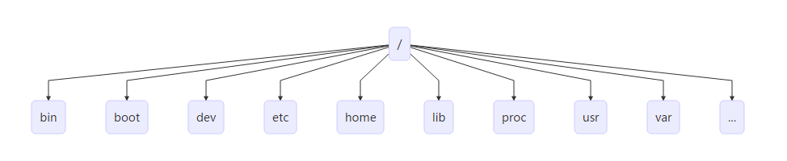

[TOC]

# 01 Linux简介

## 概述

Linux 是一种自由和开放源码的类 UNIX 操作系统，使用 Linux 内核。目前存在着许多不同的 Linux 发行版，可安装在各种各样的电脑硬件设备，从手机、平板电脑、路由器和影音游戏控制台，到桌上型电脑，大型电脑和超级电脑。 Linux 是一个领先的操作系统，世界上运算最快的 10 台超级电脑运行的都是 Linux 操作系统。

Linux 操作系统也是自由软件和开放源代码发展中最著名的例子。只要遵循 GNU 通用公共许可证,任何人和机构都可以自由地使用 Linux 的所有底层源代码，也可以自由地修改和再发布。严格来讲，Linux 这个词本身只表示 Linux 内核，但在实际上人们已经习惯了用 Linux 来形容整个基于 Linux 内核，并且使用 GNU 工程各种工具和数据库的操作系统 (也被称为 GNU/ Linux)。通常情况下，Linux 被打包成供桌上型电脑和服务器使用的 Linux 发行版本。一些流行的主流 Linux 发行版本，包括 Debian (及其衍生版本 Ubuntu)，Fedora 和 OpenSUSE 等。Kernel + Softwares + Tools 就是 Linux Distribution

目前市面上较知名的发行版有：`Ubuntu`、RedHat、`CentOS`、Debian、Fedora、SuSE、OpenSUSE、TurboLinux、BluePoint、RedFlag、Xterm、SlackWare等。

## Linux 与 Windows 比较

目前国内 Linux 更多的是应用于服务器上，而桌面操作系统更多使用的是 Windows。主要区别如下

| 比较     | Windows                                                      | Linux                                                        |
| :------- | :----------------------------------------------------------- | :----------------------------------------------------------- |
| 界面     | 界面统一，外壳程序固定所有 Windows 程序菜单几乎一致，快捷键也几乎相同 | 图形界面风格依发布版不同而不同，可能互不兼容。GNU/Linux 的终端机是从 UNIX 传承下来，基本命令和操作方法也几乎一致。 |
| 驱动程序 | 驱动程序丰富，版本更新频繁。默认安装程序里面一般包含有该版本发布时流行的硬件驱动程序，之后所出的新硬件驱动依赖于硬件厂商提供。对于一些老硬件，如果没有了原配的驱动有时很难支持。另外，有时硬件厂商未提供所需版本的 Windows 下的驱动，也会比较头痛。 | 由志愿者开发，由Linux核心开发小组发布，很多硬件厂商基于版权考虑并未提供驱动程序，尽管多数无需手动安装，但是涉及安装则相对复杂，使得新用户面对驱动程序问题（是否存在和安装方法）会一筹莫展。但是在开源开发模式下，许多老硬件尽管在 Windows 下很难支持的也容易找到驱动。HP、Intel、AMD 等硬件厂商逐步不同程度支持开源驱动，问题正在得到缓解。 |
| 使用     | 使用比较简单，容易入门。图形化界面对没有计算机背景知识的用户使用十分有利。 | 图形界面使用简单，容易入门。文字界面，需要学习才能掌握。     |
| 学习     | 系统构造复杂、变化频繁，且知识、技能淘汰快，深入学习困难。   | 系统构造简单、稳定，且知识、技能传承性好，深入学习相对容易。 |
| 软件     | 每一种特定功能可能都需要商业软件的支持，需要购买相应的授权。 | 大部分软件都可以自由获取，同样功能的软件选择较少。           |

## 安装 Linux 操作系统

原生云应用基本都是基于云服务器部署，本地化的 Linux 操作基本也都是在虚拟机中进行模拟操作。故我们只需要安装虚拟机并在虚拟机上安装对应的 Linux 操作系统即可。本套课程全部基于 **Ubuntu Server 18.04 LTS** 操作系统进行实践。

安装中需要设置镜像地址，我们使用阿里云镜像地址，`http://mirrors.aliyun.com/ubuntu/`


# 02 Linux远程控制管理

## 概述

传统的网络服务程序，FTP、POP、Telnet 本质上都是不安全的，因为它们在网络上通过明文传送口令和数据，这些数据非常容易被截获。SSH 叫做 `Secure Shell`。通过 SSH，可以把传输数据进行加密，预防攻击，传输的数据进行了压缩，可以加快传输速度。

## OpenSSH

SSH 是芬兰一家公司开发。但是受到版权和加密算法限制，现在很多人都使用 OpenSSH。OpenSSH 是 SSH 的替代软件，免费。OpenSSH 由客户端和服务端组成。

- **基于口令的安全验证：** 知道服务器的帐号密码即可远程登录，口令和数据在传输过程中都会被加密。
- **基于密钥的安全验证：** 此时需要在创建一对密钥，把公有密钥放到远程服务器上自己的宿主目录中，而私有密钥则由自己保存。

安装流程如下：

- 检查软件是否安装

```shell
sudo apt-cache policy openssh-client openssh-server
```

- 安装服务端

```shell
sudo apt-get install openssh-server
```

- 安装客户端

```shell
sudo apt-get install openssh-client
```

OpenSSH 服务器的主要配置文件为 `/etc/ssh/sshd\_config`，几乎所有的配置信息都在此文件中。

## XShell

XShell 是一个强大的安全终端模拟软件，它支持 SSH1, SSH2, 以及 Microsoft Windows 平台的 TELNET 协议。XShell 通过互联网到远程主机的安全连接以及它创新性的设计和特色帮助用户在复杂的网络环境中享受他们的工作。

XShell 可以在 Windows 界面下用来访问远端不同系统下的服务器，从而比较好的达到远程控制终端的目的。


## FinalShell

FinalShell 是一体化的的服务器，网络管理软件，不仅是 SSH 客户端，还是功能强大的开发，运维工具，充分满足开发，运维需求。


# 03 Linux目录管理

## 目录结构



| 目录    | 说明                                                         |
| :------ | :----------------------------------------------------------- |
| **bin** | 存放二进制可执行文件(`ls`, `cat`, `mkdir` 等)                |
| boot    | 存放用于系统引导时使用的各种文件                             |
| dev     | 用于存放设备文件                                             |
| **etc** | 存放系统配置文件                                             |
| home    | 存放所有用户文件的根目录                                     |
| lib     | 存放跟文件系统中的程序运行所需要的共享库及内核模块           |
| mnt     | 系统管理员安装临时文件系统的安装点                           |
| opt     | 额外安装的可选应用程序包所放置的位置                         |
| proc    | 虚拟文件系统，存放当前内存的映射                             |
| root    | 超级用户目录                                                 |
| sbin    | 存放二进制可执行文件，只有 root 才能访问                     |
| tmp     | 用于存放各种临时文件                                         |
| **usr** | 用于存放系统应用程序，比较重要的目录 `/usr/local` 本地管理员软件安装目录 |
| **var** | 用于存放运行时需要改变数据的文件                             |

## 操作文件目录

| 命令  | 说明                               | 语法                                            | 参数  | 参数说明                           |
| :---- | :--------------------------------- | :---------------------------------------------- | :---- | :--------------------------------- |
| ls    | 显示文件和目录列表                 | ls [-alrtAFR] [name...]                         |       |                                    |
|       |                                    |                                                 | -l    | 列出文件的详细信息                 |
|       |                                    |                                                 | -a    | 列出当前目录所有文件，包含隐藏文件 |
| mkdir | 创建目录                           | mkdir [-p] dirName                              |       |                                    |
|       |                                    |                                                 | -p    | 父目录不存在情况下先生成父目录     |
| cd    | 切换目录                           | cd [dirName]                                    |       |                                    |
| touch | 生成一个空文件                     |                                                 |       |                                    |
| echo  | 生成一个带内容文件                 | echo abcd > 1.txt，echo 1234 >> 1.txt           |       |                                    |
| cat   | 显示文本文件内容                   | cat [-AbeEnstTuv] [--help] [--version] fileName |       |                                    |
| cp    | 复制文件或目录                     | cp [options] source dest                        |       |                                    |
| rm    | 删除文件                           | rm [options] name...                            |       |                                    |
|       |                                    |                                                 | -f    | 强制删除文件或目录                 |
|       |                                    |                                                 | -r    | 同时删除该目录下的所有文件         |
| mv    | 移动文件或目录                     | mv [options] source dest                        |       |                                    |
| find  | 在文件系统中查找指定的文件         |                                                 |       |                                    |
|       |                                    |                                                 | -name | 文件名                             |
| grep  | 在指定的文本文件中查找指定的字符串 |                                                 |       |                                    |
| tree  | 用于以树状图列出目录的内容         |                                                 |       |                                    |
| pwd   | 显示当前工作目录                   |                                                 |       |                                    |
| ln    | 建立软链接                         |                                                 |       |                                    |
| more  | 分页显示文本文件内容               |                                                 |       |                                    |
| head  | 显示文件开头内容                   |                                                 |       |                                    |
| tail  | 显示文件结尾内容                   |                                                 |       |                                    |
|       |                                    |                                                 | -f    | 跟踪输出                           |

## 压缩解压缩

### tar

| 命令 | 语法                                        | 参数 | 参数说明                        |
| :--- | :------------------------------------------ | :--- | :------------------------------ |
| tar  | tar [-cxzjvf] 压缩打包文档的名称 欲打包目录 |      |                                 |
|      |                                             | -c   | 建立一个归档文件的参数指令      |
|      |                                             | -x   | 解开一个归档文件的参数指令      |
|      |                                             | -z   | 是否需要用 gzip 压缩            |
|      |                                             | -j   | 是否需要用 bzip2 压缩           |
|      |                                             | -v   | 压缩的过程中显示文件            |
|      |                                             | -f   | 使用档名，在 f 之后要立即接档名 |
|      |                                             | -tf  | 查看归档文件里面的文件          |

**例子：**

- 压缩文件夹：`tar -zcvf test.tar.gz test\`
- 解压文件夹：`tar -zxvf test.tar.gz`

### gzip

| 命令 | 语法                               | 参数 | 参数说明                                                     |
| :--- | :--------------------------------- | :--- | :----------------------------------------------------------- |
| gzip | gzip [选项] 压缩（解压缩）的文件名 |      |                                                              |
|      |                                    | -d   | 解压缩                                                       |
|      |                                    | -l   | 对每个压缩文件，显示压缩文件的大小，未压缩文件的大小，压缩比，未压缩文件的名字 |
|      |                                    | -v   | 对每一个压缩和解压的文件，显示文件名和压缩比                 |
|      |                                    | -num | 用指定的数字num调整压缩的速度，-1或--fast表示最快压缩方法（低压缩比），-9或--best表示最慢压缩方法（高压缩比）。系统缺省值为6 |

> 压缩文件后缀为 gz

### bzip2

| 命令  | 语法         | 参数 | 参数说明                                                     |
| :---- | :----------- | :--- | :----------------------------------------------------------- |
| bzip2 | bzip2 [-cdz] |      |                                                              |
|       |              | -d   | 解压缩                                                       |
|       |              | -z   | 压缩参数                                                     |
|       |              | -num | 用指定的数字num调整压缩的速度，-1或--fast表示最快压缩方法（低压缩比），-9或--best表示最慢压缩方法（高压缩比）。系统缺省值为6 |

> 压缩文件后缀为 bz2


# 04 Linux系统管理

## 系统管理命令

| 命令     | 说明                                          |
| :------- | :-------------------------------------------- |
| stat     | 显示指定文件的相关信息,比 ls 命令显示内容更多 |
| who      | 显示在线登录用户                              |
| hostname | 显示主机名称                                  |
| uname    | 显示系统信息                                  |
| top      | 显示当前系统中耗费资源最多的进程              |
| ps       | 显示瞬间的进程状态                            |
| du       | 显示指定的文件（目录）已使用的磁盘空间的总量  |
| df       | 显示文件系统磁盘空间的使用情况                |
| free     | 显示当前内存和交换空间的使用情况              |
| ifconfig | 显示网络接口信息                              |
| ping     | 测试网络的连通性                              |
| netstat  | 显示网络状态信息                              |
| clear    | 清屏                                          |
| kill     | 杀死一个进程                                  |

## 开关机命令

`shutdown` 命令可以用来进行关机程序，并且在关机以前传送讯息给所有使用者正在执行的程序，`shutdown` 也可以用来重开机。

| 命令     | 语法                                            | 参数       | 参数说明                                                     |
| :------- | :---------------------------------------------- | :--------- | :----------------------------------------------------------- |
| shutdown | shutdown [-t seconds] [-rkhncfF] time [message] |            |                                                              |
|          |                                                 | -t seconds | 设定在几秒钟之后进行关机程序                                 |
|          |                                                 | -k         | 并不会真的关机，只是将警告讯息传送给所有只用者               |
|          |                                                 | -r         | 关机后重新开机（重启）                                       |
|          |                                                 | -h         | 关机后停机                                                   |
|          |                                                 | -n         | 不采用正常程序来关机，用强迫的方式杀掉所有执行中的程序后自行关机 |
|          |                                                 | -c         | 取消目前已经进行中的关机动作                                 |
|          |                                                 | -f         | 关机时，不做 fcsk 动作(检查 Linux 档系统)                    |
|          |                                                 | -F         | 关机时，强迫进行 fsck 动作                                   |
|          |                                                 | time       | 设定关机的时间                                               |
|          |                                                 | message    | 传送给所有使用者的警告讯息                                   |

**重启**

- `sudo reboot`
- `sudo shutdown -r now`

**关机**

- `shutdown -h now`


# 05 Linux VIM 编辑器

## 概述

Vim 是从 vi 发展出来的一个文本编辑器。代码补完、编译及错误跳转等方便编程的功能特别丰富，在程序员中被广泛使用。

简单的来说， vi 是老式的字处理器，不过功能已经很齐全了，但是还是有可以进步的地方。 Vim 则可以说是程序开发者的一项很好用的工具。

## 运行模式

- 编辑模式：等待编辑命令输入
- 插入模式：编辑模式下，输入 `i` 进入插入模式，插入文本信息
- 命令模式：在编辑模式下，输入 `:` 进行命令模式

## 命令模式

- `:q`：直接退出vi
- `:wq`：保存后退出vi ，并可以新建文件
- `:q!`：强制退出
- `:w file`：将当前内容保存成某个文件
- `/`：查找字符串
- `:set number`： 在编辑文件显示行号
- `:set nonumber`：在编辑文件不显示行号
- `:set paste`：原样粘贴


# 06 Linux 用户和组管理

## 概述

Linux 操作系统是一个多用户操作系统，它允许多用户同时登录到系统上并使用资源。系统会根据账户来区分每个用户的文件，进程，任务和工作环境，使得每个用户工作都不受干扰。

## 使用 Root 用户

在实际生产操作中，我们基本上都是使用超级管理员账户操作 Linux 系统，也就是 Root 用户，Linux 系统默认是关闭 Root 账户的，我们需要为 Root 用户设置一个初始密码以方便我们使用。

- 设置 Root 账户密码

```shell
sudo passwd root
```

- 切换到 Root

```shell
su
```

- 设置允许远程登录 Root

```shell
vi /etc/ssh/sshd_config
# Authentication:
LoginGraceTime 120
#PermitRootLogin without-password     //注释此行
PermitRootLogin yes                             //加入此行
StrictModes yes
# 重启服务
service ssh restart
```

## 用户账户说明

- **普通用户：** 普通用户在系统上的任务是进行普通操作
- **超级管理员：** 管理员在系统上的任务是对普通用户和整个系统进行管理。对系统具有绝对的控制权，能够对系统进行一切操作。用 root 表示，root 用户在系统中拥有最高权限，默认下 Ubuntu 用户的 root 用户是不能登录的。
- **安装时创建的系统用户：** 此用户创建时被添加到 admin 组中，在 Ubuntu 中，admin 组中的用户默认是可以使用 `sudo` 命令来执行只有管理员才能执行的命令的。如果不使用 `sudo` 就是一个普通用户。

## 组账户说明

- **私有组：** 当创建一个用户时没有指定属于哪个组，Linux 就会建立一个与用户同名的私有组，此私有组只含有该用户。
- **标准组：** 当创建一个用户时可以选定一个标准组，如果一个用户同时属于多个组时，登录后所属的组为主组，其他的为附加组。

## 扩展阅读

### 账户系统文件说明

#### /etc/passwd

每一行代表一个账号，众多账号是系统正常运行所必须的，例如 bin，nobody 每行定义一个用户账户，此文件对所有用户可读。每行账户包含如下信息：

```
root:x:0:0:root:/root:/bin/bash
```

- **用户名：** 就是账号，用来对应 UID，root UID 是 0。
- **口令：** 密码，早期 UNIX 系统密码存在此字段，由于此文件所有用户都可以读取，密码容易泄露，后来这个字段数据就存放到 /etc/shadow 中，这里只能看到 X。
- **用户标示号（UID）：** 系统内唯一，root 用户的 UID 为 0，普通用户从 1000 开始，1-999 是系统的标准账户，500-65536 是可登陆账号。
- **组标示号（GID）：** 与 /etc/group 相关用来规定组名和 GID 相对应。
- **注释：** 注释账号
- **宿主目录（主文件夹）：** 用户登录系统后所进入的目录 root 在 /root/itcast
- **命令解释器（shell）：** 指定该用户使用的 shell ，默认的是 /bin/bash

#### /etc/shadow

为了增加系统的安全性，用户口令通常用 shadow passwords 保护。只有 root 可读。每行包含如下信息：

```
root:$6$Reu571.V$Ci/kd.OTzaSGU.TagZ5KjYx2MLzQv2IkZ24E1.yeTT3Pp4o/yniTjus/rRaJ92Z18MVy6suf1W5uxxurqssel.:17465:0:99999:7:::
```

- **账号名称：** 需要和 /etc/passwd 一致。

- 密码：

   

  经过加密，虽然加密，但不表示不会被破解，该文件默认权限如下：

  - -rw------- 1 root root 1560 Oct 26 17:20 passwd-
  - 只有root能都读写

- **最近修改密码日期：** 从1970-1-1起，到用户最后一次更改口令的天数

- **密码最小时间间隔：** 从1970-1-1起，到用户可以更改口令的天数

- **密码最大时间间隔：** 从1970-1-1起，必须更改的口令天数

- **密码到期警告时间：** 在口令过期之前几天通知

- **密码到期后账号宽限时间**

- **密码到期禁用账户时间：** 在用户口令过期后到禁用账户的天数

- **保留**

#### /etc/group

用户组的配置文件

```
root:x:0:
```

- **用户组名称**
- **用户组密码：** 给用户组管理员使用，通常不用
- **GID：** 用户组的ID
- **此用户支持的账号名称：** 一个账号可以加入多个用户组，例如想要 itcast 加入 root 这个用户组，将该账号填入该字段即可 `root:x:0:root`, icast 将用户进行分组是 Linux 对用户进行管理及控制访问权限的一种手段。一个中可以有多个用户，一个用户可以同时属于多个组。该文件对所有用户可读。

#### /etc/gshadow

该文件用户定义用户组口令，组管理员等信息只有root用户可读。

```
root:\*::
```

- **用户组名**
- **密码列**
- **用户组管理员的账号**
- **用户组所属账号**

### 账户管理常用命令

#### 增加用户

```shell
useradd 用户名
useradd -u (UID号)
useradd -p (口令)
useradd -g (分组)
useradd -s (SHELL)
useradd -d (用户目录)
```

如：`useradd lusifer`

增加用户名为 lusifer 的账户

#### 修改用户

```shell
usermod -u (新UID)
usermod -d (用户目录)
usermod -g (组名)
usermod -s (SHELL)
usermod -p (新口令)
usermod -l (新登录名)
usermod -L (锁定用户账号密码)
usermod -U (解锁用户账号)
```

如：`usermod -u 1024 -g group2 -G root lusifer`

将 lusifer 用户 uid 修改为 1024，默认组改为系统中已经存在的 group2，并且加入到系统管理员组

#### 删除用户

```shell
userdel 用户名 (删除用户账号)
userdel -r 删除账号时同时删除目录
```

如：`userdel -r lusifer`

删除用户名为 lusifer 的账户并同时删除 lusifer 的用户目录

#### 组账户维护

```shell
groupadd 组账户名 (创建新组)
groupadd -g 指定组GID
groupmod -g 更改组的GID
groupmod -n 更改组账户名
groupdel 组账户名 (删除指定组账户)
```

#### 口令维护

```shell
passwd 用户账户名 (设置用户口令)
passwd -l 用户账户名 (锁定用户账户)
passwd -u 用户账户名 (解锁用户账户)
passwd -d 用户账户名 (删除账户口令)
gpasswd -a 用户账户名 组账户名 (将指定用户添加到指定组)
gpasswd -d 用户账户名 组账户名 (将用户从指定组中删除)
gpasswd -A 用户账户名 组账户名 (将用户指定为组的管理员)
```

#### 用户和组状态

```shell
su 用户名(切换用户账户)
id 用户名(显示用户的UID，GID)
whoami (显示当前用户名称)
groups (显示用户所属组)
```

完成

# 07 Linux 文件权限管理

## 查看文件和目录的权限

### 概述

`ls –al` 使用 ls 不带参数只显示文件名称，通过 `ls –al` 可以显示文件或者目录的权限信息。

`ls -l 文件名` 显示信息包括：文件类型 (`d` 目录，`-` 普通文件，`l` 链接文件)，文件权限，文件的用户，文件的所属组，文件的大小，文件的创建时间，文件的名称

```
-rw-r--r-- 1 lusifer lusifer 675 Oct 26 17:20 .profile
```

- `-`：普通文件
- `rw-`：说明用户 lusifer 有读写权限，没有运行权限
- `r--`：表示用户组 lusifer 只有读权限，没有写和运行的权限
- `r--`：其他用户只有读权限，没有写权限和运行的权限

| -rw-r--r--     | 1      | lusifer      | lusifer    | 675      | Oct 26 17:20       | .profile |
| :------------- | :----- | :----------- | :--------- | :------- | :----------------- | :------- |
| 文档类型及权限 | 连接数 | 文档所属用户 | 文档所属组 | 文档大小 | 文档最后被修改日期 | 文档名称 |

| -        | rw-                    | r--                         | r--                   |
| :------- | :--------------------- | :-------------------------- | :-------------------- |
| 文档类型 | 文档所有者权限（user） | 文档所属用户组权限（group） | 其他用户权限（other） |

### 文档类型

- `d` 表示目录
- `l` 表示软连接
- `–` 表示文件
- `c` 表示串行端口字符设备文件
- `b` 表示可供存储的块设备文件
- 余下的字符 3 个字符为一组。`r` 只读，`w` 可写，`x` 可执行，`-` 表示无此权限

### 连接数

指有多少个文件指向同一个索引节点。

### 文档所属用户和所属组

就是文档属于哪个用户和用户组。文件所属用户和组是可以更改的

### 文档大小

默认是 bytes

## 更改操作权限

### chown

是 change owner 的意思，主要作用就是改变文件或者目录所有者，所有者包含用户和用户组

- `chown [-R] 用户名称 文件或者目录`
- `chown [-R] 用户名称 用户组名称 文件或目录`

> **-R：** 进行递归式的权限更改，将目录下的所有文件、子目录更新为指定用户组权限

### chmod

改变访问权限

- `chmod [who] [+ | - | =] [mode] 文件名`

#### who

表示操作对象可以是以下字母的一个或者组合

- u：用户 user
- g：用户组 group
- o：表示其他用户
- a：表示所有用户是系统默认的

#### 操作符号

- +：表示添加某个权限
- -：表示取消某个权限
- =：赋予给定的权限，取消文档以前的所有权限

#### mode

表示可执行的权限，可以是 r、w、x

#### 文件名

文件名可以使空格分开的文件列表

#### 示例

```shell 
lusifer@UbuntuBase:~$ ls -al test.txt 
-rw-rw-r-- 1 lusifer lusifer 6 Nov  2 21:47 test.txt
lusifer@UbuntuBase:~$ chmod u=rwx,g+r,o+r test.txt 
lusifer@UbuntuBase:~$ ls -al test.txt 
-rwxrw-r-- 1 lusifer lusifer 6 Nov  2 21:47 test.txt
lusifer@UbuntuBase:~$
```

## 数字设定法

数字设定法中数字表示的含义

- 0 表示没有任何权限
- 1 表示有可执行权限 = `x`
- 2 表示有可写权限 = `w`
- 4 表示有可读权限 = `r`

也可以用数字来表示权限如 `chmod 755 file\_name`

| r w x | r – x | r - x  |
| :---- | :---- | :----- |
| 4 2 1 | 4 - 1 | 4 - 1  |
| user  | group | others |

- 若要 rwx 属性则 4+2+1=7
- 若要 rw- 属性则 4+2=6
- 若要 r-x 属性则 4+1=5

```shell
lusifer@UbuntuBase:~$ chmod 777 test.txt 
lusifer@UbuntuBase:~$ ls -al test.txt 
-rwxrwxrwx 1 lusifer lusifer 6 Nov  2 21:47 test.txt
lusifer@UbuntuBase:~$ chmod 770 test.txt 
lusifer@UbuntuBase:~$ ls -al test.txt 
-rwxrwx--- 1 lusifer lusifer 6 Nov  2 21:47 test.txt
```


# 08 Linux 软件包管理

APT(Advanced Packaging Tool) 是 Debian/Ubuntu 类 Linux 系统中的软件包管理程序, 使用它可以找到想要的软件包, 而且安装、卸载、更新都很简便；也可以用来对 Ubuntu 进行升级; APT 的源文件为 `/etc/apt/` 目录下的 `sources.list` 文件。

## 修改数据源

由于国内的网络环境问题，我们需要将 Ubuntu 的数据源修改为国内数据源，操作步骤如下：

---

Ubuntu：

### 查看系统版本

```shell 
lsb_release -a
# 输出如下
No LSB modules are available.
Distributor ID: Ubuntu
Description:    Ubuntu 18.04.2 LTS
Release:        18.04
Codename:       bionic
```

> **注意：** Codename 为 `bionic`，该名称为我们 Ubuntu 系统的名称，修改数据源需要用到该名称
>
> lsb 是 Linux Standard Base的缩写

### 编辑数据源

```shell
vi /etc/apt/sources.list
```

删除全部内容并修改为

```shell
deb http://mirrors.aliyun.com/ubuntu/ bionic main restricted universe multiverse
deb http://mirrors.aliyun.com/ubuntu/ bionic-security main restricted universe multiverse
deb http://mirrors.aliyun.com/ubuntu/ bionic-updates main restricted universe multiverse
deb http://mirrors.aliyun.com/ubuntu/ bionic-backports main restricted universe multiverse
```

### 更新数据源

```shell
apt-get update
```

---

CentOS这么弄：

```
cd /etc/yum.repos.d/
mv CentOS-Base.repo CentOS-Base.repo.bak
wget -O CentOS-Base.repo http://mirrors.aliyun.com/repo/Centos-7.repo
yum clean all
yum makecache
yum update
```

---


## 常用 APT 命令

- 安装软件包：`apt-get install <Package Name>`

- 删除软件包：`apt-get remove <Package Name>`

- 更新软件包列表：`apt-get update`

- 升级有可用更新的系统(**慎用**)：`apt-get upgrade`

- 搜索：`apt-cache search <Package Name>`

- 获取包信息：`apt-cache show <Package Name>`

- 删除包及配置文件：`apt-get remove <Package Name> --purge`

- 了解使用依赖：`apt-cache depends <Package Name>`

- 查看被哪些包依赖：`apt-cache rdepends <Package Name>`

- 安装相关的编译环境：`apt-get build-dep <Package Name>`

- 下载源代码：`apt-get source <Package Name>`

- 清理无用的包：`apt-get clean && apt-get autoclean`

- 检查是否有损坏的依赖：`apt-get check`

  ---

  ## yum常用命令

  **yum命令**是在Fedora和RedHat以及SUSE中基于[rpm](http://man.linuxde.net/rpm)的软件包管理器，它可以使系统管理人员交互和自动化地更细与管理RPM软件包，能够从指定的服务器自动下载RPM包并且安装，可以自动处理依赖性关系，并且一次安装所有依赖的软体包，无须繁琐地一次次下载、安装。

  yum提供了查找、安装、删除某一个、一组甚至全部软件包的命令，而且命令简洁而又好记。

  ### 语法

  ```
  　　yum(选项)(参数)
  ```

  ### 选项

  ```
  　　-h：显示帮助信息；
  　　-y：对所有的提问都回答“yes”；
  　　-c：指定配置文件；
  　　-q：安静模式；
  　　-v：详细模式；
  　　-d：设置调试等级（0-10）；
  　　-e：设置错误等级（0-10）；
  　　-R：设置yum处理一个命令的最大等待时间；
  　　-C：完全从缓存中运行，而不去下载或者更新任何头文件。
  ```

  ### 参数

  - [install](http://man.linuxde.net/install)：安装rpm软件包；
  - update：更新rpm软件包；
  - check-update：检查是否有可用的更新rpm软件包
  - remove：删除指定的rpm软件包；
  - list：显示软件包的信息； search：检查软件包的信息；
  - [info](http://man.linuxde.net/info)：显示指定的rpm软件包的描述信息和概要信息；
  - clean：清理yum过期的缓存；
  - shell：进入yum的shell提示符；
  - resolvedep：显示rpm软件包的依赖关系；
  - localinstall：安装本地的rpm软件包；
  - localupdate：显示本地rpm软件包进行更新；
  - deplist：显示rpm软件包的所有依赖关系。

  ### 实例

  部分常用的命令包括：

  - 自动搜索最快镜像插件：`yum install yum-fastestmirror`
  - 安装yum图形窗口插件：`yum install yumex`
  - 查看可能批量安装的列表：`yum grouplist`

  **安装**

  ```
  　　yum install              #全部安装
  　　yum install package1     #安装指定的安装包package1
  　　yum groupinsall group1   #安装程序组group1
  ```

  **更新和升级**

  ```
  　　yum update               #全部更新
  　　yum update package1      #更新指定程序包package1
  　　yum check-update         #检查可更新的程序
  　　yum upgrade package1     #升级指定程序包package1
  　　yum groupupdate group1   #升级程序组group1
  ```

  **查找和显示**

  ```
  　　yum info package1      #显示安装包信息package1
  　　yum list               #显示所有已经安装和可以安装的程序包
  　　yum list package1      #显示指定程序包安装情况package1
  　　yum groupinfo group1   #显示程序组group1信息yum search string 根据关键字string查找安装包
  ```

  **删除程序**

  ```
  　　yum remove &#124; erase package1   #删除程序包package1
  　　yum groupremove group1             #删除程序组group1
  　　yum deplist package1               #查看程序package1依赖情况
  ```

  **清除缓存**

  ```
  　　yum clean packages       #清除缓存目录下的软件包
  　　yum clean headers        #清除缓存目录下的 headers
  　　yum clean oldheaders     #清除缓存目录下旧的 headers
  ```


# 09 Linux 部署应用程序

## 安装 Java

### 解压缩并移动到指定目录

- 解压缩：`tar -zxvf jdk-8u152-linux-x64.tar.gz`
- 创建目录：`mkdir -p /usr/local/java`
- 移动安装包：`mv jdk1.8.0_152/ /usr/local/java/`
- 设置所有者：`chown -R root:root /usr/local/java/`

### 配置环境变量

- 配置系统环境变量：`vi /etc/environment`
- 修改系统环境变量

```shell
PATH="/usr/local/sbin:/usr/local/bin:/usr/sbin:/usr/bin:/sbin:/bin:/usr/games:/usr/local/games"
export JAVA_HOME=/usr/local/java/jdk1.8.0_152
export JRE_HOME=/usr/local/java/jdk1.8.0_152/jre
export CLASSPATH=$CLASSPATH:$JAVA_HOME/lib:$JAVA_HOME/jre/lib
```

- 配置用户环境变量：`vi /etc/profile`
- 修改用户环境变量

```
if [ "$PS1" ]; then
  if [ "$BASH" ] && [ "$BASH" != "/bin/sh" ]; then
    # The file bash.bashrc already sets the default PS1.
    # PS1='\h:\w\$ '
    if [ -f /etc/bash.bashrc ]; then
      . /etc/bash.bashrc
    fi
  else
    if [ "`id -u`" -eq 0 ]; then
      PS1='# '
    else
      PS1='$ '
    fi
  fi
fi
export JAVA_HOME=/usr/local/java/jdk1.8.0_152
export JRE_HOME=/usr/local/java/jdk1.8.0_152/jre
export CLASSPATH=$CLASSPATH:$JAVA_HOME/lib:$JAVA_HOME/jre/lib
export PATH=$JAVA_HOME/bin:$JAVA_HOME/jre/bin:$PATH:$HOME/bin
if [ -d /etc/profile.d ]; then
  for i in /etc/profile.d/*.sh; do
    if [ -r $i ]; then
      . $i
    fi
  done
  unset i
fi
```

- 使用户环境变量生效：`source /etc/profile`

### 验证安装是否成功

```
java -version
# 输出如下
java version "1.8.0_152"
Java(TM) SE Runtime Environment (build 1.8.0_152-b16)
Java HotSpot(TM) 64-Bit Server VM (build 25.152-b16, mixed mode)
```

## 安装 Tomcat

### 解压缩并移动到指定目录

- 解压缩：`tar -zxvf apache-tomcat-8.5.23.tar.gz`
- 变更目录：`mv apache-tomcat-8.5.23 tomcat`
- 移动目录：`mv tomcat/ /usr/local/`

### 验证安装是否成功

- 启动：
  - `/usr/local/tomcat/bin/startup.sh`
  - `./startup.sh`
- 停止：
  - `/usr/local/tomcat/bin/shutdown.sh`
  - `./shutdown.sh`

## 安装 MySQL

### 安装

- 更新数据源：`apt-get update`
- 安装数据库：`apt-get install mysql-server`

> **注意：** 系统将提示您在安装过程中创建 root 密码。选择一个安全的密码，并确保你记住它，因为你以后需要它。接下来，我们将完成 MySQL 的配置。

### 配置

> **注意：** 因为是全新安装，您需要运行附带的安全脚本。这会更改一些不太安全的默认选项，例如远程 root 登录和示例用户。在旧版本的 MySQL 上，您需要手动初始化数据目录，但最新的 MySQL 已经自动完成了。

```
mysql_secure_installation
```

这将提示您输入您在之前步骤中创建的 root 密码。您可以按 Y，然后 ENTER 接受所有后续问题的默认值，但是要询问您是否要更改 root 密码。您只需在之前步骤中进行设置即可，因此无需现在更改。

### 验证安装是否成功

按上边方式安装完成后，MySQL 应该已经开始自动运行了。要测试它，请检查其状态。

```
systemctl status mysql
# 输出如下
● mysql.service - MySQL Community Server
   Loaded: loaded (/lib/systemd/system/mysql.service; enabled; vendor preset: enabled)
   Active: active (running) since Tue 2017-11-21 13:04:34 CST; 3min 24s ago
 Main PID: 2169 (mysqld)
   CGroup: /system.slice/mysql.service
           └─2169 /usr/sbin/mysqld
Nov 21 13:04:33 ubuntu systemd[1]: Starting MySQL Community Server...
Nov 21 13:04:34 ubuntu systemd[1]: Started MySQL Community Server.
```

### 常用命令

- 查看版本：`mysqladmin -p -u root version`
- 启动：`service mysql start`
- 停止：`service mysql stop`
- 重启：`service mysql restart`
- 登录：`mysql -u root -p`
- 授权：`grant all privileges on *.* to 'root'@'%' identified by 'Your Password';`

### 扩展阅读

#### 配置使用密码方式登录

在安装过程中可能没有提示密码设置的环节此时默认使用的是 **auth_socket** 方式登录，我们需要修改为 **mysql_native_password** 方式，操作步骤如下

- 本地登录 MySQL，此时无需输入密码

```
mysql -u root -p
```

- 切换数据库到 mysql

```
use mysql;
```

- 修改 root 账号密码

```
update user set authentication_string=password('123456') where user='root';
```

- 设置登录模式

```
update user set plugin="mysql_native_password";
```

- 刷新配置

```
flush privileges;
```

- 退出 MySQL

```
exit;
```

- 重新启动 MySQL

```
systemctl restart mysql
```

#### 配置远程访问

- 修改配置文件

```
vi /etc/mysql/mysql.conf.d/mysqld.cnf
```

- 注释掉(语句前面加上 `#` 即可)：

```
# bind-address = 127.0.0.1
```

- 重启 MySQL

```
service mysql restart
```

- 登录 MySQL

```
mysql -u root -p
```

- 授权 root 用户允许所有人连接

```
grant all privileges on *.* to 'root'@'%' identified by 'Your Password';
```

#### 因弱口令无法成功授权解决步骤

- 查看和设置密码安全级别

```
select @@validate_password_policy;
set global validate_password_policy=0;
```

- 查看和设置密码长度限制

```
select @@validate_password_length;
set global validate_password_length=1;
```

#### 其它配置

修改配置文件：`vi /etc/mysql/mysql.conf.d/mysqld.cnf`

```shell 
[client]
default-character-set=utf8
[mysqld]
default-storage-engine=INNODB
character-set-server=utf8
collation-server=utf8_general_ci
lower-case-table-names=1
```

> **注意：** 配置内容追加到对应节点的底部即可


# 10 Linux LVM 磁盘扩容


## LVM 的基本概念

- **物理卷 Physical Volume (PV)：** 可以在上面建立卷组的媒介，可以是硬盘分区，也可以是硬盘本身或者回环文件（loopback file）。物理卷包括一个特殊的 header，其余部分被切割为一块块物理区域（physical extents）
- **卷组 Volume group (VG)：** 将一组物理卷收集为一个管理单元
- **逻辑卷 Logical volume (LV)：** 虚拟分区，由物理区域（physical extents）组成
- **物理区域 Physical extent (PE)：** 硬盘可供指派给逻辑卷的最小单位（通常为 4MB）

## 磁盘操作相关命令

- 查看挂载点

```
df -h
# 输出如下
Filesystem                         Size  Used Avail Use% Mounted on
udev                               955M     0  955M   0% /dev
tmpfs                              198M  1.8M  196M   1% /run
## 此处为我们磁盘的挂载点
/dev/mapper/ubuntu--vg-ubuntu--lv   19G  6.0G   12G  35% /
tmpfs                              986M     0  986M   0% /dev/shm
tmpfs                              5.0M     0  5.0M   0% /run/lock
tmpfs                              986M     0  986M   0% /sys/fs/cgroup
/dev/loop1                          91M   91M     0 100% /snap/core/6350
/dev/loop0                          89M   89M     0 100% /snap/core/6964
/dev/sda2                          976M  143M  767M  16% /boot
```

- 显示当前的 logical volume：`lvdisplay`

```
lvdisplay
# 输出如下
--- Logical volume ---
LV Path                /dev/ubuntu-vg/ubuntu-lv
LV Name                ubuntu-lv
VG Name                ubuntu-vg
LV UUID                e2fKkR-oZeH-WV2A-ltCi-P76v-N9yv-aUtIg1
LV Write Access        read/write
LV Creation host, time ubuntu-server, 2019-05-14 03:13:57 +0800
LV Status              available
# open                 1
LV Size                <19.00 GiB
Current LE             4863
Segments               1
Allocation             inherit
Read ahead sectors     auto
- currently set to     256
Block device           253:0
```

- 显示当前的 volume group

```
vgdisplay
# 输出如下
--- Volume group ---
VG Name               ubuntu-vg
System ID             
Format                lvm2
Metadata Areas        1
Metadata Sequence No  2
VG Access             read/write
VG Status             resizable
MAX LV                0
Cur LV                1
Open LV               1
Max PV                0
Cur PV                1
Act PV                1
## 这里应该是你当前的可用空间大小，待扩容完毕，这里显示的应该是最终的大小
VG Size               <19.00 GiB
PE Size               4.00 MiB
Total PE              4863
Alloc PE / Size       4863 / <19.00 GiB
Free  PE / Size       0 / 0   
VG UUID               dhI9ns-7lOI-pXf8-IOWL-F96N-JIYG-ZF6u82
```

- 显示当前的 physical volume

```
pvdisplay
# 输出如下
--- Physical volume ---
PV Name               /dev/sda3
VG Name               ubuntu-vg
PV Size               <19.00 GiB / not usable 0   
Allocatable           yes (but full)
PE Size               4.00 MiB
Total PE              4863
Free PE               0
Allocated PE          4863
PV UUID               TDFe2b-xsce-R8So-ldxR-ohcp-fx5J-n2JNOa
```

## 开始 LVM 扩容

### 查看 fdisk

```
fdisk -l
# 输出如下
Disk /dev/loop0: 88.4 MiB, 92733440 bytes, 181120 sectors
Units: sectors of 1 * 512 = 512 bytes
Sector size (logical/physical): 512 bytes / 512 bytes
I/O size (minimum/optimal): 512 bytes / 512 bytes
Disk /dev/loop1: 91 MiB, 95408128 bytes, 186344 sectors
Units: sectors of 1 * 512 = 512 bytes
Sector size (logical/physical): 512 bytes / 512 bytes
I/O size (minimum/optimal): 512 bytes / 512 bytes
Disk /dev/sda: 20 GiB, 21474836480 bytes, 41943040 sectors
Units: sectors of 1 * 512 = 512 bytes
Sector size (logical/physical): 512 bytes / 512 bytes
I/O size (minimum/optimal): 512 bytes / 512 bytes
Disklabel type: gpt
Disk identifier: F96F20D7-1F28-4B03-87CF-4FA3E81FDE29
Device       Start      End  Sectors Size Type
/dev/sda1     2048     4095     2048   1M BIOS boot
/dev/sda2     4096  2101247  2097152   1G Linux filesystem
/dev/sda3  2101248 41940991 39839744  19G Linux filesystem
Disk /dev/mapper/ubuntu--vg-ubuntu--lv: 19 GiB, 20396900352 bytes, 39837696 sectors
Units: sectors of 1 * 512 = 512 bytes
Sector size (logical/physical): 512 bytes / 512 bytes
I/O size (minimum/optimal): 512 bytes / 512 bytes

```

### 查看所有储存设备

```
fdisk -l |grep '/dev'
# 输出如下
Disk /dev/loop0: 88.4 MiB, 92733440 bytes, 181120 sectors
Disk /dev/loop1: 91 MiB, 95408128 bytes, 186344 sectors
## 目前只有一块磁盘 sda
Disk /dev/sda: 20 GiB, 21474836480 bytes, 41943040 sectors
/dev/sda1     2048     4095     2048   1M BIOS boot
/dev/sda2     4096  2101247  2097152   1G Linux filesystem
/dev/sda3  2101248 41940991 39839744  19G Linux filesystem
Disk /dev/mapper/ubuntu--vg-ubuntu--lv: 19 GiB, 20396900352 bytes, 39837696 sectors

# 在虚拟机中挂载多一块磁盘，再操作
fdisk -l |grep '/dev'
# 输出如下
Disk /dev/loop0: 88.4 MiB, 92733440 bytes, 181120 sectors
Disk /dev/loop1: 91 MiB, 95408128 bytes, 186344 sectors
## 挂载的第一块磁盘 sda
Disk /dev/sda: 20 GiB, 21474836480 bytes, 41943040 sectors
/dev/sda1     2048     4095     2048   1M BIOS boot
/dev/sda2     4096  2101247  2097152   1G Linux filesystem
/dev/sda3  2101248 41940991 39839744  19G Linux filesystem
## 挂载的第二块磁盘 sdb
Disk /dev/sdb: 20 GiB, 21474836480 bytes, 41943040 sectors
Disk /dev/mapper/ubuntu--vg-ubuntu--lv: 19 GiB, 20396900352 bytes, 39837696 sectors

```

### 创建 sdb 分区

```
fdisk /dev/sdb
# 输出如下
Welcome to fdisk (util-linux 2.31.1).
Changes will remain in memory only, until you decide to write them.
Be careful before using the write command.
Device does not contain a recognized partition table.
Created a new DOS disklabel with disk identifier 0x0de15f1d.
## 在此处输入命令
## n：新建分区
## l: 选择逻辑分区，如果没有，则首先创建主分区（p），然后再添加逻辑分区（硬盘最多四个分区 P-P-P-P 或 P-P-P-E）
Command (m for help): n
Partition type
   p   primary (0 primary, 0 extended, 4 free)
   e   extended (container for logical partitions)
Select (default p):
Using default response p.
Partition number (1-4, default 1): 
First sector (2048-41943039, default 2048): 
Last sector, +sectors or +size{K,M,G,T,P} (2048-41943039, default 41943039): 
Created a new partition 1 of type 'Linux' and of size 20 GiB.
## 在此处输入命令
## w：写入磁盘
Command (m for help): w
The partition table has been altered.
Calling ioctl() to re-read partition table.
Syncing disks.
```

### 格式化磁盘

- 查看分区

```
fdisk -l |grep '/dev'
# 输出如下
Disk /dev/loop0: 88.4 MiB, 92733440 bytes, 181120 sectors
Disk /dev/loop1: 91 MiB, 95408128 bytes, 186344 sectors
Disk /dev/sda: 20 GiB, 21474836480 bytes, 41943040 sectors
/dev/sda1     2048     4095     2048   1M BIOS boot
/dev/sda2     4096  2101247  2097152   1G Linux filesystem
/dev/sda3  2101248 41940991 39839744  19G Linux filesystem
Disk /dev/sdb: 20 GiB, 21474836480 bytes, 41943040 sectors
## 此时可以看见新创建的分区 /dev/sdb1
/dev/sdb1        2048 41943039 41940992  20G 83 Linux
Disk /dev/mapper/ubuntu--vg-ubuntu--lv: 19 GiB, 20396900352 bytes, 39837696 sectors

```

- 格式化

```
mkfs -t ext4 /dev/sdb1
# 输出如下
mke2fs 1.44.1 (24-Mar-2018)
Creating filesystem with 5242624 4k blocks and 1310720 inodes
Filesystem UUID: 6f11063f-c118-4099-90fc-2b083c181b23
Superblock backups stored on blocks: 
        32768, 98304, 163840, 229376, 294912, 819200, 884736, 1605632, 2654208, 
        4096000
Allocating group tables: done                            
Writing inode tables: done                            
Creating journal (32768 blocks): done
Writing superblocks and filesystem accounting information: done
```

### 创建 PV

```
pvcreate /dev/sdb1
# 输出如下
WARNING: ext4 signature detected on /dev/sdb1 at offset 1080. Wipe it? [y/n]: y
  Wiping ext4 signature on /dev/sdb1.
  Physical volume "/dev/sdb1" successfully created.
```

### 查看卷组

```
pvscan
# 输出如下
PV /dev/sda3   VG ubuntu-vg       lvm2 [<19.00 GiB / 0    free]
PV /dev/sdb1                      lvm2 [<20.00 GiB]
Total: 2 [<39.00 GiB] / in use: 1 [<19.00 GiB] / in no VG: 1 [<20.00 GiB]
```

### 扩容 VG

- 查看 VG

```
vgdisplay
# 输出如下
--- Volume group ---
## 我们需要用到 VG Name
VG Name               ubuntu-vg
System ID             
Format                lvm2
Metadata Areas        1
Metadata Sequence No  2
VG Access             read/write
VG Status             resizable
MAX LV                0
Cur LV                1
Open LV               1
Max PV                0
Cur PV                1
Act PV                1
VG Size               <19.00 GiB
PE Size               4.00 MiB
Total PE              4863
Alloc PE / Size       4863 / <19.00 GiB
Free  PE / Size       0 / 0   
VG UUID               dhI9ns-7lOI-pXf8-IOWL-F96N-JIYG-ZF6u82
```

- 扩容 VG

```
vgextend ubuntu-vg /dev/sdb1
# 输出如下
Volume group "ubuntu-vg" successfully extended
```

### 扩容 LV

- 查看 VG

```
vgdisplay
# 输出如下
--- Volume group ---
VG Name               ubuntu-vg
System ID             
Format                lvm2
Metadata Areas        2
Metadata Sequence No  3
VG Access             read/write
VG Status             resizable
MAX LV                0
Cur LV                1
Open LV               1
Max PV                0
Cur PV                2
Act PV                2
VG Size               38.99 GiB
PE Size               4.00 MiB
Total PE              9982
Alloc PE / Size       4863 / <19.00 GiB
## 这里是可以扩容的大小
Free  PE / Size       5119 / <20.00 GiB
VG UUID               dhI9ns-7lOI-pXf8-IOWL-F96N-JIYG-ZF6u82
```

- 查看 LV

```
lvdisplay
# 输出如下
--- Logical volume ---
## 我们需要用到 LV Path
LV Path                /dev/ubuntu-vg/ubuntu-lv
LV Name                ubuntu-lv
VG Name                ubuntu-vg
LV UUID                e2fKkR-oZeH-WV2A-ltCi-P76v-N9yv-aUtIg1
LV Write Access        read/write
LV Creation host, time ubuntu-server, 2019-05-14 03:13:57 +0800
LV Status              available
# open                 1
LV Size                <19.00 GiB
Current LE             4863
Segments               1
Allocation             inherit
Read ahead sectors     auto
- currently set to     256
Block device           253:0
```

- 扩容 LV

```
# 按固定大小追加
lvextend -L +10G /dev/ubuntu-vg/ubuntu-lv
# 按百分比追加
lvextend -l +100%FREE /dev/ubuntu-vg/ubuntu-lv
# 输出如下
Size of logical volume ubuntu-vg/ubuntu-lv changed from <19.00 GiB (4863 extents) to 38.99 GiB (9982 extents).
Logical volume ubuntu-vg/ubuntu-lv successfully resized.
```

- 刷新分区

```
resize2fs /dev/ubuntu-vg/ubuntu-lv
# 输出如下
Filesystem at /dev/ubuntu-vg/ubuntu-lv is mounted on /; on-line resizing required
old_desc_blocks = 3, new_desc_blocks = 5
The filesystem on /dev/ubuntu-vg/ubuntu-lv is now 10221568 (4k) blocks long.

```

- 如果系统是CentOS 7，刷新分区的时候，可能会遇到如下错误(这里我用的lv是：/dev/centos/root)：

- ```
  resize2fs: Bad magic number in super-block while trying to open .....
  Couldn't find valid filesystem superblock.
  ```

  原因是文件系统是xfs，要用的命令不一样：

  (centos7.0开始默认文件系统是xfs，centos6是ext4，centos5是ext3)

  查看确认一下文件系统：

  ```
  cat /etc/fstab | grep centos-home
  ```

  确实是xfs，那就好办了：

  ```
  xfs_growfs /dev/centos/root
  ```

  然后，一切OK了。

- 验证是否成功

```
lvdisplay
--- Logical volume ---
LV Path                /dev/ubuntu-vg/ubuntu-lv
LV Name                ubuntu-lv
VG Name                ubuntu-vg
LV UUID                e2fKkR-oZeH-WV2A-ltCi-P76v-N9yv-aUtIg1
LV Write Access        read/write
LV Creation host, time ubuntu-server, 2019-05-14 03:13:57 +0800
LV Status              available
# open                 1
## 可以看到磁盘扩容成功了
LV Size                38.99 GiB
Current LE             9982
Segments               2
Allocation             inherit
Read ahead sectors     auto
- currently set to     256
Block device           253:0
```

> **注意：** 不要卸载扩容的磁盘，可能出现丢失数据或是系统无法启动


### 附录: 查看磁盘分区的文件系统格式

#### 1. df -T， 可查看已挂载的目录的文件系统格式

```
df -T
[root@node1 ~]# df -T
文件系统                类型        1K-块    已用     可用 已用% 挂载点
devtmpfs                devtmpfs   927200       0   927200    0% /dev
tmpfs                   tmpfs      938708       0   938708    0% /dev/shm
tmpfs                   tmpfs      938708    9080   929628    1% /run
tmpfs                   tmpfs      938708       0   938708    0% /sys/fs/cgroup
/dev/mapper/centos-root xfs      53440008 1423824 52016184    3% /
/dev/sda1               xfs       1038336  195092   843244   19% /boot
/dev/mapper/centos-home xfs      20969468   33052 20936416    1% /home
tmpfs                   tmpfs      187744       0   187744    0% /run/user/0


```


#### 2. Fdisk -l ， 可查看所有已挂载及未挂载的分区，但不显示文件系统格式

```
[root@node1 ~]# fdisk -l

磁盘 /dev/sdb：10.7 GB, 10737418240 字节，20971520 个扇区
Units = 扇区 of 1 * 512 = 512 bytes
扇区大小(逻辑/物理)：512 字节 / 4096 字节
I/O 大小(最小/最佳)：4096 字节 / 4096 字节
磁盘标签类型：dos
磁盘标识符：0xc945e256

   设备 Boot      Start         End      Blocks   Id  System
/dev/sdb1            2048    20971519    10484736   83  Linux

磁盘 /dev/sda：68.7 GB, 68719476736 字节，134217728 个扇区
Units = 扇区 of 1 * 512 = 512 bytes
扇区大小(逻辑/物理)：512 字节 / 4096 字节
I/O 大小(最小/最佳)：4096 字节 / 4096 字节
磁盘标签类型：dos
磁盘标识符：0x000c13a9

   设备 Boot      Start         End      Blocks   Id  System
/dev/sda1   *        2048     2099199     1048576   83  Linux
/dev/sda2         2099200   134217727    66059264   8e  Linux LVM

磁盘 /dev/mapper/centos-root：54.7 GB, 54744055808 字节，106921984 个扇区
Units = 扇区 of 1 * 512 = 512 bytes
扇区大小(逻辑/物理)：512 字节 / 4096 字节
I/O 大小(最小/最佳)：4096 字节 / 4096 字节


磁盘 /dev/mapper/centos-swap：2147 MB, 2147483648 字节，4194304 个扇区
Units = 扇区 of 1 * 512 = 512 bytes
扇区大小(逻辑/物理)：512 字节 / 4096 字节
I/O 大小(最小/最佳)：4096 字节 / 4096 字节


磁盘 /dev/mapper/centos-home：21.5 GB, 21483225088 字节，41959424 个扇区
Units = 扇区 of 1 * 512 = 512 bytes
扇区大小(逻辑/物理)：512 字节 / 4096 字节
I/O 大小(最小/最佳)：4096 字节 / 4096 字节
```

#### 3. parted -l ，可查看未挂载的文件系统类型，以及哪些分区未格式化

```
[root@node1 ~]# parted -l
Model: ATA centos-0 SSD (scsi)
Disk /dev/sda: 68.7GB
Sector size (logical/physical): 512B/4096B
Partition Table: msdos
Disk Flags:

Number  Start   End     Size    Type     File system  标志
 1      1049kB  1075MB  1074MB  primary  xfs          启动
 2      1075MB  68.7GB  67.6GB  primary               lvm


Model: ATA node1-0 SSD (scsi)
Disk /dev/sdb: 10.7GB
Sector size (logical/physical): 512B/4096B
Partition Table: msdos
Disk Flags:

Number  Start   End     Size    Type     File system  标志
 1      1049kB  10.7GB  10.7GB  primary


Model: Linux device-mapper (linear) (dm)
Disk /dev/mapper/centos-home: 21.5GB
Sector size (logical/physical): 512B/4096B
Partition Table: loop
Disk Flags:

Number  Start  End     Size    File system  标志
 1      0.00B  21.5GB  21.5GB  xfs


Model: Linux device-mapper (linear) (dm)
Disk /dev/mapper/centos-swap: 2147MB
Sector size (logical/physical): 512B/4096B
Partition Table: loop
Disk Flags:

Number  Start  End     Size    File system     标志
 1      0.00B  2147MB  2147MB  linux-swap(v1)


Model: Linux device-mapper (linear) (dm)
Disk /dev/mapper/centos-root: 54.7GB
Sector size (logical/physical): 512B/4096B
Partition Table: loop
Disk Flags:

Number  Start  End     Size    File system  标志
 1      0.00B  54.7GB  54.7GB  xfs
```

#### 4. Lsblk -f 也可以查看未挂载的文件系统类型

```
[root@node1 ~]# lsblk -f
NAME            FSTYPE      LABEL UUID                                   MOUNTPOINT
sda
├─sda1          xfs               8c3ea309-43c9-407b-966d-93e63dd4b74d   /boot
└─sda2          LVM2_member       j01s9f-zQ9J-qo9c-iMn2-bdfI-FzCX-1tHXd5
  ├─centos-root xfs               8607499a-edb0-4dec-b013-c0ddd3e6e215   /
  ├─centos-swap swap              b76f03bb-dad7-42c4-b227-d02187d91b94   [SWAP]
  └─centos-home xfs               c29f686e-0a76-4def-a18e-5ad698aba50c   /home
sdb
└─sdb1          LVM2_member       6xOhQt-NpLQ-Jm1E-YUAm-raLU-mGlA-0pOvCU
  └─centos-root xfs               8607499a-edb0-4dec-b013-c0ddd3e6e215   /
sr0
[root@node1 ~]#
```


#### 5. File -s /dev/sdb1

```
[root@node1 ~]# file -s /dev/sdb1
/dev/sdb1: LVM2 PV (Linux Logical Volume Manager), UUID: 6xOhQt-NpLQ-Jm1E-YUAm-raLU-mGlA-0pOvCU, size: 10736369664
```

#### 6. 查看可用的文件系统类型

```
[root@node1 etc]# cat /etc/filesystems
xfs
ext4
ext3
ext2
nodev proc
nodev devpts
iso9660
vfat
hfs
hfsplus
*
```

